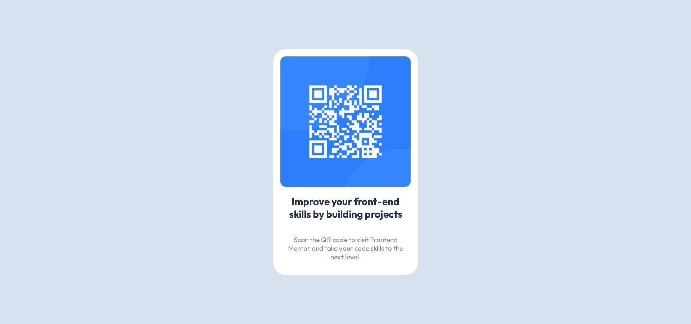

# Frontend Mentor - QR code component solution

This is a solution to the [QR code component challenge on Frontend Mentor](https://www.frontendmentor.io/challenges/qr-code-component-iux_sIO_H). Frontend Mentor challenges help you improve your coding skills by building realistic projects. 

## Table of contents

- [Overview](#overview)
  - [Screenshot](#screenshot)
  - [Links](#links)
- [My process](#my-process)
  - [Built with](#built-with)
  - [What I learned](#what-i-learned)
  - [Continued development](#continued-development)
  - [Useful resources](#useful-resources)
- [Author](#author)
- [Acknowledgments](#acknowledgments)

**Note: Delete this note and update the table of contents based on what sections you keep.**

## Overview

### Screenshot




### Links

- Solution URL: [Add solution URL here](https://github.com/lriofrio915/qr-code-component-main)
- Live Site URL: [Add live site URL here](https://cerulean-belekoy-39d11b.netlify.app/)

## My process

At the begining I was so excited to start the challenge, I finished index.html without trouble, but when the challenge continue with css I have a lot of code problem, I think and i think, but i didn't know how solve the problem.. so, i looking for help in youtube.. finish succesfull.!
Solving problems step by step are extremely useful.

### Built with

- Semantic HTML5 markup
- CSS custom properties
- Flexbox
- CSS Grid
- Mobile-first workflow


### What I learned

In HTML, I learned to think in parent and child container, think in boxes model.

```html
<div class = "container">
  <h1>Some HTML code I'm proud of</h1>
  <h2>coding for live</h2>	
</div>
```

In CSS style, I learned to center a div using flexbox. I learned to set inicial variables in the root and body too. I setted the font family style.

```css
.container {
  display: flex;
  justify-content: center;
}
```


### Continued development

In the future, I want to continue learn responsive designe.


## Author

- Website - [luisRiofrio](https://github.com/lriofrio915)
- Frontend Mentor - [@lriofrio915](https://www.frontendmentor.io/profile/lriofrio915)
- Twitter - [@LuisRio50739101](https://twitter.com/LuisRio50739101)


## Acknowledgments

I want to thankful to DevSafio youtube channel. Your content helps me to understand step by step the solution.
(https://www.youtube.com/watch?v=I-FvoQTGVlI&t=7s)
